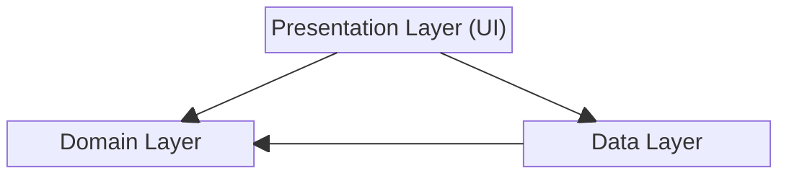

# Android Mobile Application (Kotlin + Clean Architecture)

## Code Coverage by Jacoco
The project maintains a 75% code coverage goal, reflecting Google’s best-practice range for well-tested software.
Rather than maximizing the percentage, our testing strategy emphasizes reliability, maintainability, and meaningful coverage of essential logic.
This approach ensures we maintain strong test confidence without introducing unnecessary overhead.

[Code coverage report on CodeCov](https://app.codecov.io/github/anhtuanmai/rickandmorty)
