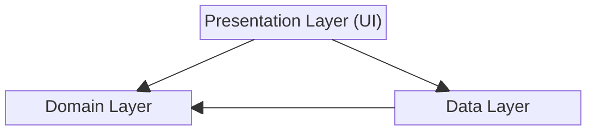

# Rick and Morty Android Application 
Modern Android development showcase with Clean Architecture and Jetpack Compose

## 📱 About
This repository demonstrates how to structure Android features using Clean Architecture, MVVM, and unidirectional data flow.​
The UI is built with Jetpack Compose and powered by Kotlin Coroutines/Flow, while dependency management is handled via Hilt to keep modules decoupled and testable.​
The goal is clarity over complexity: readable code, documented decisions, and practical patterns you can reuse in production apps.

## ✨ Features
- Browse a list of Rick and Morty characters fetched from the public API.
- Local caching for offline access and faster reloads.
- Save and manage a personal list of favorite characters.
- Character details.

## 🛠 Tech Stack

**Architecture & Patterns**
- Clean Architecture (Domain/Data/Presentation layers)
- MVVM with Repository pattern
- Dependency Injection (Hilt/Dagger)

**UI & UX**
- Jetpack Compose
- Material Design 3
- Navigation Component

**Concurrency & Networking**
- Kotlin Coroutines & Flow
- Retrofit & OkHttp
- Room Database & DataStore

**Testing**
- JUnit4, JUnit5, MockK
- Robolectric
- Espresso 
  
**Code Coverage by Jacoco**

The project maintains a **75%** code coverage goal, reflecting Google’s best-practice range for well-tested software.
Rather than maximizing the percentage, our testing strategy emphasizes reliability, maintainability, and meaningful coverage of essential logic.
This approach ensures we maintain strong test confidence without introducing unnecessary overhead.

[Code coverage report on CodeCov](https://app.codecov.io/github/anhtuanmai/rickandmorty)

**CI/CD**
- GitHub Actions & Bitrise
- Automated testing & builds

## 🏗 Clean Architecture

Please read [**The Clean Code Blog** by Robert C. Martin (Uncle Bob)](https://blog.cleancoder.com/uncle-bob/2012/08/13/the-clean-architecture.html)

